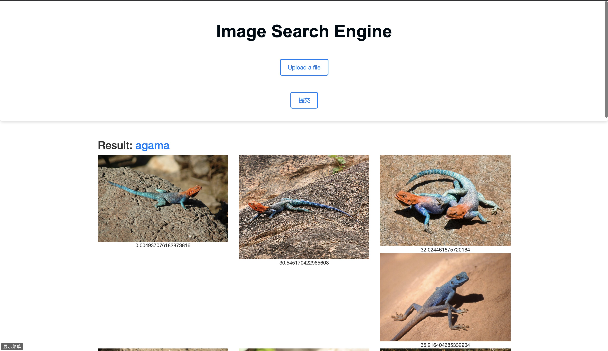

# Image Search Engine




## Overview

- 使用yolov8进行图像识别，使用在imagenet1k数据集上预训练的resnet模型提取特征，并对每一类物体分别使用特征向量构建kd搜索树和annoy搜索树用于搜索，使用时，从网页前端捕获用户输入，传入后端使用yolov8识别出物体类别，使用resent50提取该图像特征，该特征会在该图像对应的kd树中进行搜索比较，将该类别中最相似的20张图片以及该物体名称传输至前端进行展示

- `extractor.py`:使用在imagenet1k上预训练的resnet50来提取特征，并用于kd树和annoy搜索树的构建，将二者保存在imagenetkdt文件夹下用于后续的搜索
- `server.py`: 这段脚本运行一个网络服务器。可以通过 Flask 网络界面将图片返回到本地。本地通过kd树搜索最相似的图片展示到网页上
-  `best.pt`:在食物数据集上使用yolov8训练的模型，识别精度99%，若要进行食物识别可以修改代码使用
-  `yolo8l-cls.pt`:在imagenet1k上预训练的yolov8模型，没有微调过，可以直接进行图像分类
- GPUs are not required.
- python 3.10

## Link

- `imagenet-mini`:https://www.kaggle.com/datasets/ifigotin/imagenetmini-1000
- `imagekdt`:链接: https://pan.baidu.com/s/1jNHZ637vBj8IozsmBjVaPA?pwd=c9cs 提取码: c9cs

## Usage
```bash
git clone https://github.com/geshang777/ImageSearchEngineV2.git
conda create -n ISE python=3.10
conda activate ISE
cd ImageSearchEngineV2-main
pip install -r requirements.txt
# 从链接下载imagenet-mini和imagenetkdt文件放在放在static文件夹下
python extractor.py#若下载了imagekdt文件则不用运行
python server.py
#访问localhost:5000即可进入搜索引擎
```

## TODOList

-  当前数据集只有食物数据，且类别比较少，需要扩充✅
-  使用更高效的搜索算法✅
-   使用云服务器读取数据
